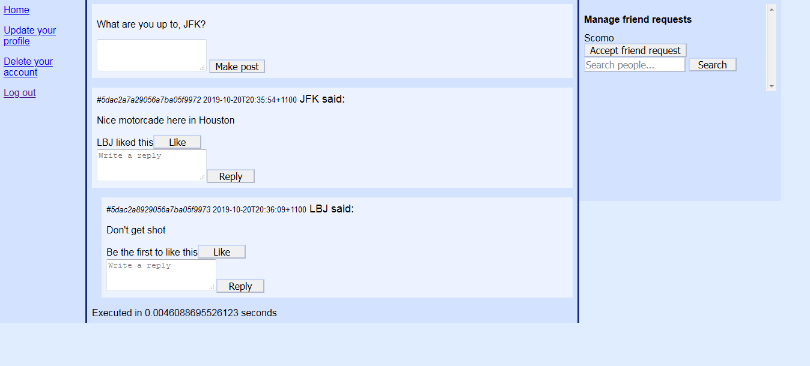

FaceMagazine
============
FaceMagazine is a  facebook/reddit-like social network written in PHP, with
branches supporting Oracle database and MongoDB.

Features
========
* Create user accounts with visibility settings
    * Private: only you can see your account's posts.
    * Friends-only: only you can your friends can see your account's posts.
    * Public: Anyone can see your posts
* Search for and add friends
    * Search looks for full name and nickname.
    * The other person has to accept your request.
* A newsfeed that shows:
    * Your posts
    * Friends' posts
    * Public posts
* Delete your account, including all your posts!
* Update your profile
    * This is only shown on the search screen, as there are no profile pages.
    * Like other peoples' posts, with facebook-like flavour text telling you
    to 'Be the first to like this', or 'So-and-so and 2 others like this'.

Installation
============

Requirements
------------
* PHP 5 or 7.
* A webserver with the PHP module installed. Apache httpd was used for testing.
* An Oracle or MongoDB database.

Steps
-----
1. Use git to check out either branch `mongo` or `oracle`, depending on which
is the database system that you will use for FaceMagazine.

2. Change the connection string in `fbl_common.php` to connect to your database.

3. Install the PHP source into your web server directory. e.g. /var/www/html/
is the default for Apache.
